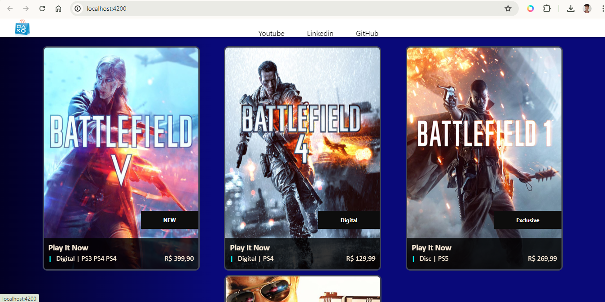

<h1>#Projeto Playstation Store Clone em Angular</h1>

Projeto em Angular criado seguindo as aulas da Formação Angular Developer da Digital Innovation One. Consiste em, basicamente em clone de uma página da Playstaion Store utilizando o conecito de SPA. A estrutura é toda componentizada em nível 'atômico', facilitando a organização dos arquivos, evitando que cada arquivo fique grande demais. E, assim, facilitando, por exemplo, um possível processo de manutenção posterior.

